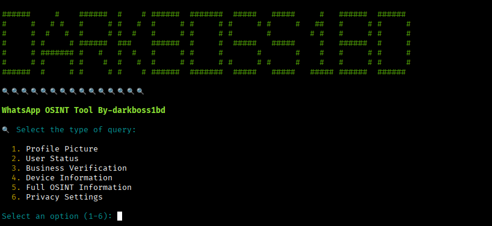

<h1 align="center">WHATSAPP LOOKUP DARKBOSS1BD 🕵️‍♂️</h1>

<p align="center">
  <strong>OSINT tool for WhatsApp</strong> that allows you to obtain profile pictures, 
  verify Business accounts, check user status and information, 
  analyze linked devices, review privacy settings, and 
  access full data using the <strong>WhatsApp Darkbooss1bd OSINT</strong> API from RapidAPI.
  <br>
  Supports 6 endpoints: <em>about, base64, business, devices, doublecheck, privacy</em>.
</p>

<p align="center">
  
</p>

---

## 🚀 Features

- Retrieve WhatsApp profile pictures by phone number
- Verify WhatsApp Business accounts
- Query user status and information
- Analyze linked devices
- Full OSINT information
- Privacy settings
- Automatic validation of phone number formats
- Support for international numbers (with country code)
- Terminal interface with interactive menu and colors
- Automatic saving of images in JPG format
- Detection of profiles without or hidden profile pictures

## 📌 Requirements

- Python 3.8+

- Libraries: `requests`, `python-dotenv`, `colorama`

# 🔑 API Key (RapidAPI)

NAME | KEY |
| ------------------- |-------------- |
| [Whatsapp OSINT](https://rapidapi.com/inutil-inutil-default/api/whatsapp-osint) |  🔑 (Required) |

- Choose a plan → [Basic](https://rapidapi.com/inutil-inutil-default/api/whatsapp-osint/pricing)  
- Copy your **API Key**  
- Rename the file `.env.example` to `.env`  
- And add your API Key in the `.env` file

### 🛠️ Step 1: Configure the .env file with your API

In the root of your project, run:
```bash
cp .env.example .env
```
🔹 This creates a new file named .env with the same content as .env.example.

🔹 .env.example remains intact (serves as a template).

🛠️ Step 2: Open the .env file for editing

Use nano (or any editor like vim or VS Code):
```bash
nano .env
```

🛠️ Step 3: Edit the variables

Inside nano you will see something like this (example):

RAPIDAPI_KEY=tu_api_key_aqui

👉 You must fill the values with the correct data for your local environment.
For example:

RAPIDAPI_KEY=yysnssksls536m3mdlldldmdddlld

🛠️ Step 4: Save changes in nano

Press Ctrl + O → means “Write Out” (save).

It will ask for confirmation of the name (.env), press Enter.

Exit the editor with Ctrl + X.

🛠️ Step 5: Verify it was saved

Run:
```bash
cat .env
```

⚠️ Usage Warning

This tool has been created exclusively for:

Legitimate cybersecurity investigations

Authorized security audits

OSINT projects for educational purposes

Analysis with explicit consent

🔴 Do not use this tool for illegal activities, harassment, or without people’s consent.

🟢 The author is not responsible for any misuse others may give it.

---
## ⚙️ Installation

Clone the repository:

```bash
git clone https://github.com/darkboss1bd/whatsapp_lookup-darkboss1bd.git
```
```bash
cd whatsapp_lookup-darkboss1bd
```
```bash
pip install -r requirements.txt
```

 Basic Usage
Run the script:
```bash
python3 whatsapp_lookup-darkboss1bd.py
```
Select an option from the menu (1-6)

Enter the phone number with country code (e.g., 51987654321)

The tool will validate the format and send the query

The results will be displayed according to the type of query selected

> **The project is open to collaborators..**


## SUPPORTED DISTRIBUTIONS
Distribution	Verified Version	Supported?	Status
Kali Linux	2025.2	yes	working
Parrot Security OS	6.3	yes	working
Windows	11	yes	working
BackBox	9	yes	working
Arch Linux	2024.12.01	yes	working

SUPPORT
Questions, issues or suggestions: darkboss1bd@gmail.com

LICENSE

 Whats Lookup is licensed.

